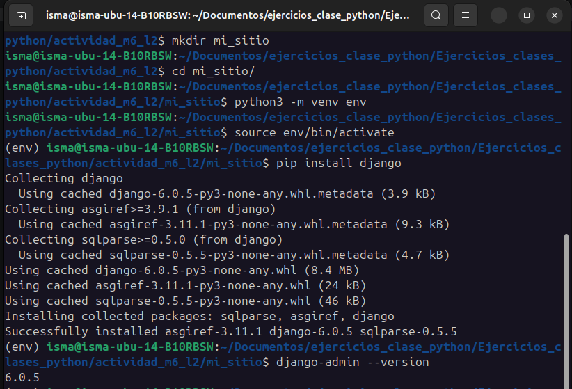
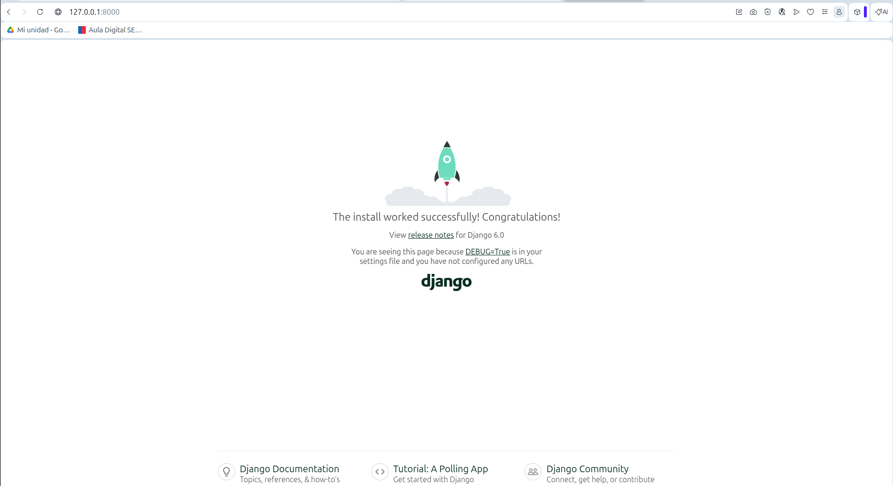

# Actividad M6 L2

## 1. Instalacion en entorno virtual 

    python3 -m venv env
    source env/bin/activate
    pip install django
    django-admin --version 

**¿Qué es pip? ¿Qué ventajas ofrece instalar Django dentro de un entorno virtual?**
R: pip es un gestor de paquetes de Python, sirve para gestionar e instalar paquetes de Python.

## 2. Crear el proyecto 

**Crea el proyecto con el comando** 
    django-admin startproject mi_sitio

Estructura generada por Django:

mi_sitio/
    manage.py
    mi_sitio/
        __init__.py
        asgi.py
        settings.py
        urls.py
        wsgi.py

**Explicación de los elementos:**

**manage.py**: Es una utilidad de línea de comandos que permite interactuar con el proyecto Django. Se utiliza para ejecutar tareas administrativas como iniciar el servidor de desarrollo (`runserver`), ejecutar migraciones de bases de datos, crear aplicaciones, etc.

**mi_sitio/__init__.py**: Es un archivo vacío que le indica a Python que el directorio actual debe tratarse como un paquete de Python para poder importar módulos desde él.

**mi_sitio/settings.py**: Contiene toda la configuración del proyecto Django. Aquí se definen las conexiones a las bases de datos, aplicaciones instaladas, configuraciones de seguridad, idioma, zona horaria y archivos estáticos.

**mi_sitio/urls.py**: Es el "índice" o enrutador principal del proyecto. Aquí se definen los patrones de las URLs del sitio y se conectan con las vistas que deben procesar las peticiones a dichas rutas.

**mi_sitio/wsgi.py**: Es el punto de entrada para los servidores web compatibles con WSGI (Web Server Gateway Interface). Su principal utilidad es permitir el despliegue del proyecto en un servidor en entorno de producción.

## 3. Ejecutar el servidor 
• Corre el servidor de desarrollo con: 
    python3 manage.py runserver 

• Visita http://127.0.0.1:8000/ y toma una captura de pantalla mostrando que el servidor funciona  correctamente. 

## 4. Crear una aplicación 
• Crea una aplicación llamada principal:
    python3 manage.py startapp principal

• Explica brevemente: 
• ¿Qué diferencia hay entre un “proyecto” y una “aplicación” en Django? 
**R:** Un **proyecto** es la configuración global y el contenedor de todo el sitio web. Una **aplicación** es un submódulo independiente que cumple una función específica (ej. un blog, una tienda, un foro). Un proyecto puede estar compuesto por múltiples aplicaciones.

• ¿Qué carpetas se generan dentro de la app principal?
**R:** Dentro de la app se genera la carpeta `migrations/` (para llevar el control de los cambios en la base de datos). Además, se generan varios archivos fundamentales como `__init__.py`, `admin.py`, `apps.py`, `models.py`, `tests.py` y `views.py`.

## 5. Configuración del proyecto 
• Agrega 'principal' al INSTALLED_APPS de settings.py. 
• Crea un archivo urls.py dentro de la app principal y configura el enrutamiento en mi_sitio/urls.py para  que dirija hacia esa app. 
Puedes usar una vista sencilla que devuelva HttpResponse("¡Bienvenido a mi sitio!"). 
