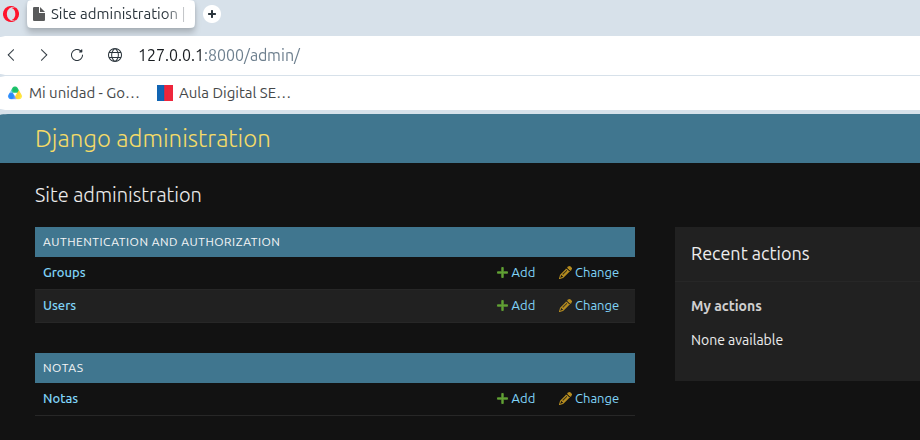

# Actividad modulo 7 leccion 7

## 1. ¿Qué son las aplicaciones preinstaladas? 
>>• Define brevemente qué es una aplicación “preinstalada” en Django. 
**R: Son componentes modulares que vienen incluidos por defecto con el framework Django. Proporcionan funcionalidades comunes y esenciales para el desarrollo web (como autenticación, sesiones, un panel de administración, etc.), evitando que los desarrolladores tengan que "reinventar la rueda" en cada proyecto.**

>>• ¿Dónde se declaran y activan estas aplicaciones en un proyecto? 
**R: Se declaran y activan en la lista `INSTALLED_APPS` dentro del archivo `settings.py` del proyecto. Django solo cargará y utilizará las aplicaciones que se encuentren en esta lista.**

>>• Copia y pega el bloque INSTALLED_APPS de tu archivo settings.py y comenta qué hace cada una  de estas apps: 
R: 
    INSTALLED_APPS = [
        'django.contrib.admin',         # App del core de Django
        'django.contrib.auth',          # App del core de Django
        'django.contrib.contenttypes',  # App del core de Django
        'django.contrib.sessions',      # App del core de Django
        'django.contrib.messages',      # App del core de Django
        'django.contrib.staticfiles',   # App del core de Django
        'usuarios',                     # App propia del proyecto
        'biblioteca',                   # App propia del proyecto
        'reclamos',                     # App propia del proyecto
    ]

>>• django.contrib.admin 
**R: Proporciona una interfaz de administración lista para usar, generada automáticamente a partir de los modelos del proyecto. Es una herramienta potente para que los administradores del sitio gestionen el contenido.**

>>• django.contrib.auth 
**R: Gestiona todo el sistema de autenticación: usuarios, grupos y permisos. Incluye modelos (como `User` y `Group`) y vistas para manejar el inicio y cierre de sesión, y la gestión de contraseñas.**

>>• django.contrib.contenttypes 
**R: Es un framework de bajo nivel que rastrea todos los modelos instalados en el proyecto. Permite crear relaciones genéricas entre modelos, siendo una pieza clave para el funcionamiento de otras apps como `admin` y `auth`.**

>>• django.contrib.sessions 
**R: Permite almacenar y recuperar datos para cada visitante del sitio. Es fundamental para mantener el estado del usuario entre diferentes peticiones, como por ejemplo, saber si un usuario ha iniciado sesión.**

>>• django.contrib.messages 
**R: Proporciona un sistema para enviar notificaciones temporales (conocidas como "flash messages") al usuario. Es útil para mostrar mensajes de éxito, error o advertencia después de una acción (ej. "Formulario enviado correctamente").**

>>• django.contrib.staticfiles 
**R: Gestiona los archivos estáticos del proyecto (CSS, JavaScript, imágenes). Proporciona utilidades para recolectar todos estos archivos de las diferentes aplicaciones en una única ubicación para servirlos en producción.**

## 2. Interacción con modelos preinstalados 
>>Desde el shell de Django (python manage.py shell), importa y explora algunos modelos de las  aplicaciones preinstaladas:

    from django.contrib.auth.models import User, Group
    from django.contrib.sessions.models import Session

>>Crea un usuario con User.objects.create_user() 
**R:**
    usuario_1 = User.objects.create_user('usuario_1', 'usuario_1@mail.com', 'password123')

>>• Asigna el usuario a un grupo 
**R:**
    Group.objects.create(name='Grupo_1')
    grupo = Group.objects.get(name='Grupo_1')
    user = User.objects.get(username='usuario_1') 
    # Se utiliza el método .add() en el manager de la relación Many-to-Many (groups)
    user.groups.add(grupo)  # para asociar el usuario con el grupo.

>>• Consulta las sesiones activas con Session.objects.all() 
**R:**
    Session.objects.all()

## 3. Acceso desde el Admin 
>>• Asegúrate de tener el sitio admin habilitado. 
>>• Crea un superusuario y accede al panel en http://localhost:8000/admin. 
>>• Toma una captura de pantalla del panel de administración mostrando alguno de los modelos  preinstalados activos (Usuarios, Grupos, Sesiones, etc.) 

## 4. Reflexión final 
>>Responde brevemente: 
>>• ¿Cuál de estas aplicaciones crees que es más importante para el desarrollo de una aplicación real y por qué? 
**R: Aunque todas son fundamentales, `django.contrib.auth` y `django.contrib.admin` suelen ser las de mayor impacto inmediato. `auth` es crucial porque la mayoría de las aplicaciones web requieren gestión de usuarios. Por su parte, `admin` acelera drásticamente el desarrollo al proporcionar un backend funcional para la gestión de datos con un esfuerzo mínimo, lo que es invaluable para la creación de prototipos y la administración diaria del sitio.**

>>• ¿Qué te llamó la atención al explorar el sistema de administración de Django? 
**R: Me pareció muy intuitivo y potente. Lo que más llama la atención es cómo, con solo registrar un modelo, Django genera automáticamente una interfaz completa para crear, leer, actualizar y eliminar registros (CRUD), incluyendo validaciones de formularios y widgets adecuados para cada tipo de dato. La capacidad de personalizar y extender esta interfaz es también un gran punto a favor.**
