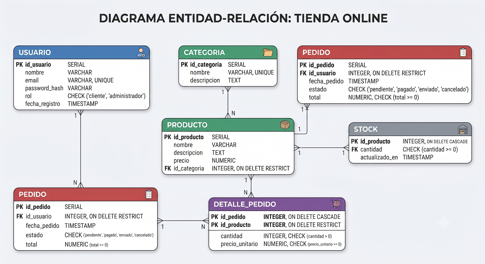
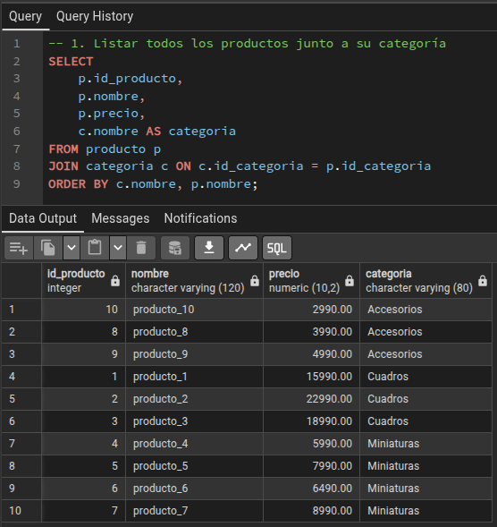
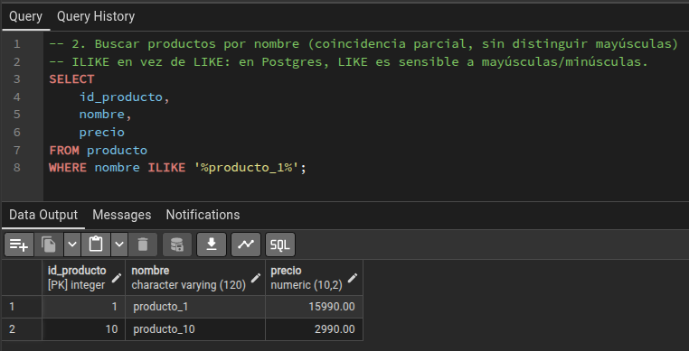
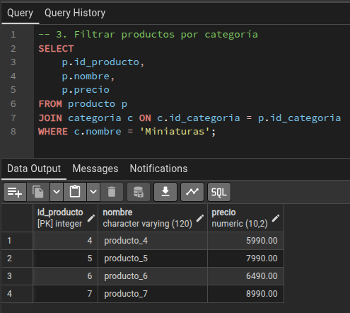
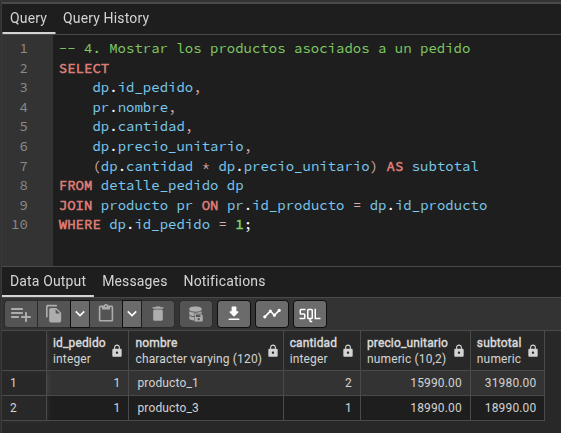
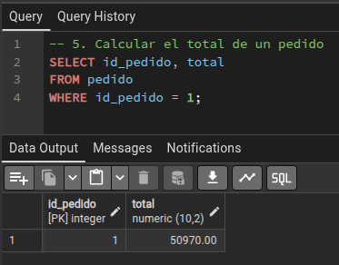
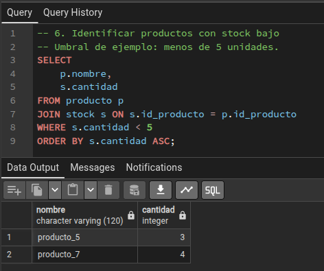
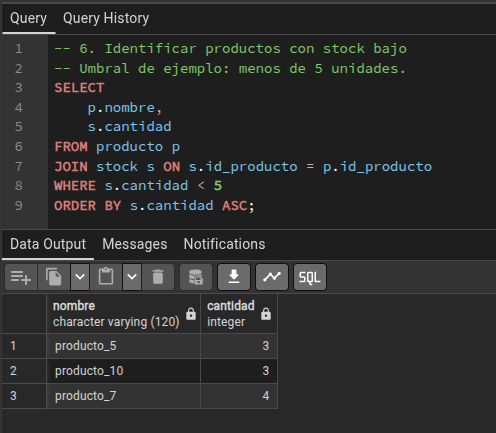

# Base de datos relacional — E-commerce (Módulo 5)

## 1. Descripción general

Base de datos relacional para un e-commerce, implementada en PostgreSQL (`ecommerce_db`). 
Modela usuarios, productos, categorías, pedidos, el detalle de cada pedido y el stock de cada producto.

Entidades principales:

| Tabla            | Descripción                                                              |
|------------------|---------------------------------------------------------------------------|
| `usuario`        | Clientes y administradores (distinguidos por la columna `rol`).         |
| `categoria`       | Categorías de productos (Cuadros, Miniaturas, Accesorios).              |
| `producto`        | Catálogo de productos, cada uno asociado a una categoría.               |
| `stock`           | Cantidad disponible por producto (relación 1:1 con `producto`).         |
| `pedido`          | Pedidos realizados por un usuario, con estado y total.                  |
| `detalle_pedido`  | Líneas de cada pedido (producto, cantidad, precio al momento de compra).|

**Decisiones de diseño relevantes:**



## 2. Orden de ejecución de los scripts

Ejecutar en este orden exacto contra la base `ecommerce_db`:

```bash
psql -d ecommerce_db -f schema.sql
psql -d ecommerce_db -f seed.sql
psql -d ecommerce_db -f queries.sql
psql -d ecommerce_db -f transaction.sql
```

- `schema.sql` Crea las tablas.
- `seed.sql` Datos de ejemplo para ecommerce_db.
- `queries.sql` Las consultas solicitadas
- `transaction.sql` se puede ejecutar varias veces (cada vez crea un pedido nuevo de `usuario_4`), siempre que haya stock suficiente.

## 3. Evidencia de ejecución de las consultas

Los valores de esta sección son los esperados según los datos cargados en `seed.sql` y después de ejecutar `transaction.sql` una vez. **Reemplazar por la salida real de `psql` al entregar** (por ejemplo, con `psql -d ecommerce_db -f queries.sql > evidencia_consultas.txt`).

### Consulta 1 — Productos con su categoría (extracto)



### Consulta 2 — Búsqueda por nombre (`%producto_1%`)




### Consulta 3 — Productos de la categoría "Miniaturas"



### Consulta 4 — Productos del pedido 1



### Consulta 5 — Total del pedido 1



### Consulta 6 — Productos con stock bajo (< 5 unidades)



Después de ejecutar `transaction.sql` (que descuenta 2 unidades de `producto_8` y 3 de `producto_10`):



