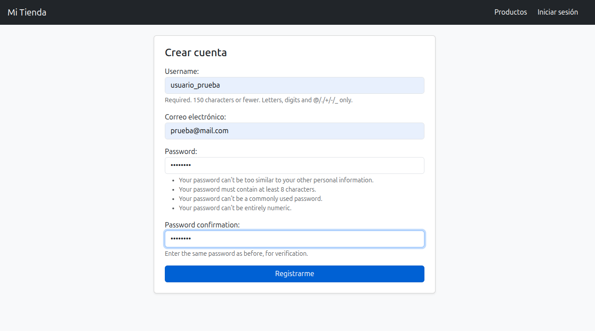
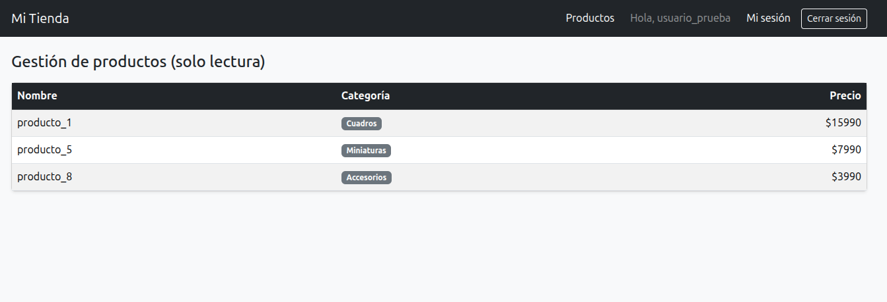
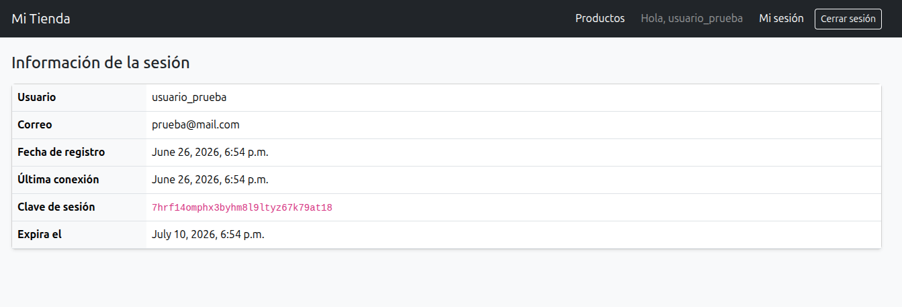
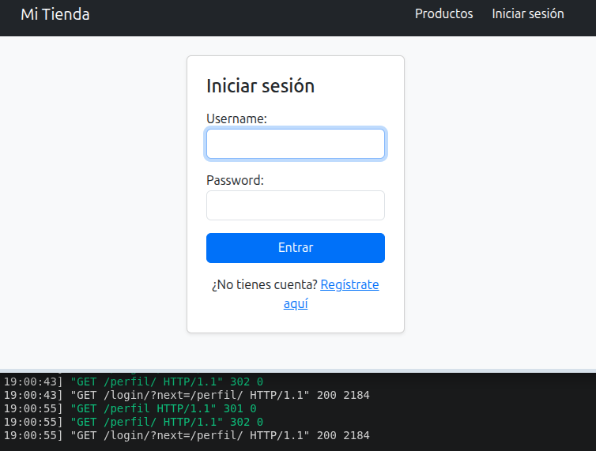

# Módulo 6 — Autenticación de usuarios con Django

## 1. Descripción general

Proyecto Django (`config`) con una app de autenticación (`loggin`) que implementa:

- Registro de usuario con formulario propio (`RegistroForm`, hereda de `UserCreationForm` y agrega `email`).
- Inicio y cierre de sesión usando las vistas integradas de Django (`LoginView`, `LogoutView`).
- Una vista pública de catálogo (`/productos/`), visible con o sin sesión activa.
- Una vista protegida (`/perfil/`), accesible solo si hay sesión activa — redirige a `/login/` en caso contrario.
- Template base (`base.html`) con navegación que cambia según el estado de la sesión.

## 2. Pasos para ejecutar el proyecto

```bash
# Clonar / descomprimir el proyecto y entrar a la carpeta
cd config

# Crear y activar entorno virtual
python3 -m venv venv
source venv/bin/activate        # En Windows: venv\Scripts\activate

# Instalar dependencias
pip install django

# Crear las tablas de la base de datos (incluye auth_user y sesiones)
python manage.py migrate

# (Opcional) crear un superusuario para entrar a /admin/
python manage.py createsuperuser

# Levantar el servidor de desarrollo
python manage.py runserver
```

La aplicación queda disponible en `http://127.0.0.1:8000/`.

## 3. Rutas principales

| Ruta          | Vista              | Acceso                          | Descripción                                   |
|---------------|--------------------|----------------------------------|------------------------------------------------|
| `/login/`     | `LoginView`        | Pública                         | Formulario de inicio de sesión.               |
| `/logout/`    | `LogoutView`       | Requiere sesión (botón POST)    | Cierra la sesión y redirige a `/login/`.      |
| `/registro/`  | `registro_view`    | Pública                         | Crea una cuenta y abre sesión automáticamente.|
| `/productos/` | `productos_view`   | Pública                         | Catálogo de ejemplo, solo lectura.            |
| `/perfil/`    | `perfil_view`      | **Protegida** (`@login_required`)| Información de la cuenta y de la sesión activa.|

Si un usuario sin sesión intenta entrar a `/perfil/`, Django lo redirige a `/login/?next=/perfil/` (configurado en `settings.py` vía `LOGIN_URL`).

## 4. Usuario de prueba

No se incluye un usuario precargado por fixture. Para probar el flujo completo, registra una cuenta nueva desde `/registro/`, por ejemplo:

| Campo      | Valor                  |
|------------|-------------------------|
| Usuario    | `usuario_prueba`       |
| Correo     | `prueba@mail.com`      |
| Contraseña | (la que definas al registrarte) |

Al registrarte, el sistema te deja la sesión abierta automáticamente y te redirige a `/perfil/`.

## 5. Evidencia de ejecución

### 5.1 Registro de usuario
`/registro/` — formulario completado y envío exitoso.



### 5.2 Inicio de sesión
`/login/` — login con el usuario creado en el paso anterior.



### 5.3 Acceso a la vista protegida

- **Con sesión activa**: `/perfil/` muestra los datos de la cuenta y de la sesión (usuario, correo, fecha de registro, clave de sesión, expiración).

 


- **Sin sesión activa**: al cerrar sesión (botón "Cerrar sesión") e intentar entrar de nuevo a `/perfil/`, Django redirige a `/login/?next=/perfil/`.




## 6. Notas técnicas relevantes

- `/productos/` es intencionalmente **pública**: representa el catálogo de un e-commerce, que cualquier visitante debe poder ver sin necesidad de cuenta. La protección de acceso recae solo en `/perfil/`.
- `usuario.last_login` puede aparecer vacío la primera vez que alguien entra justo después de registrarse, porque la sesión se abre en el mismo request en que se crea la cuenta. Es comportamiento esperado de Django, no un error.