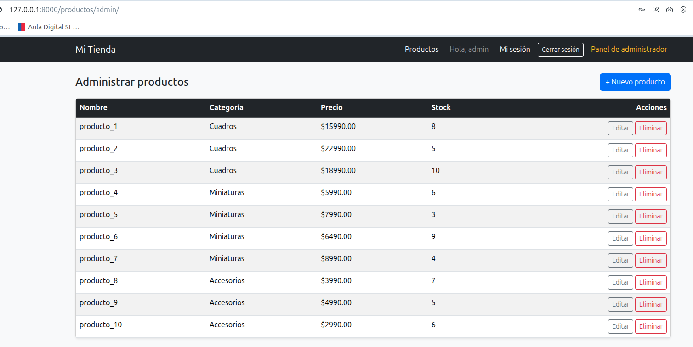
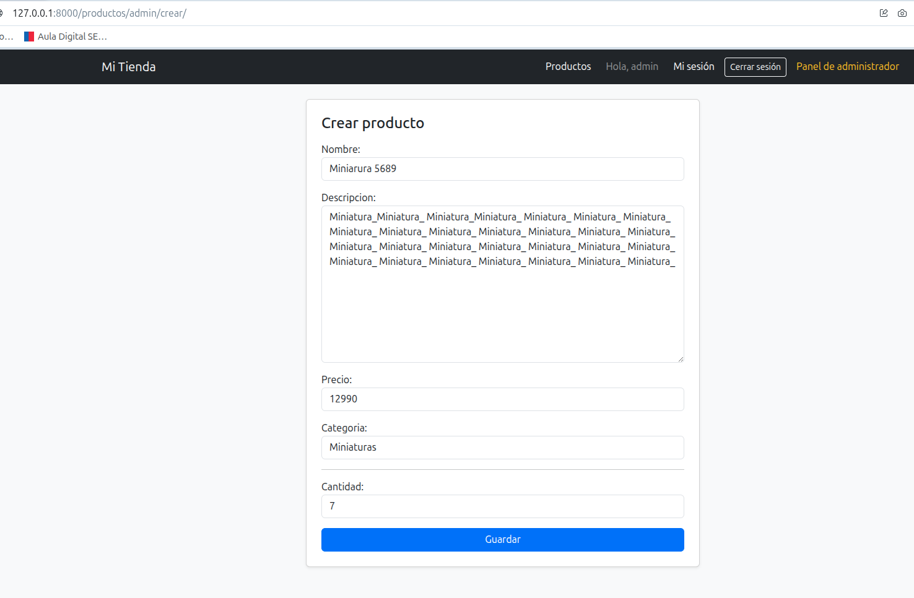
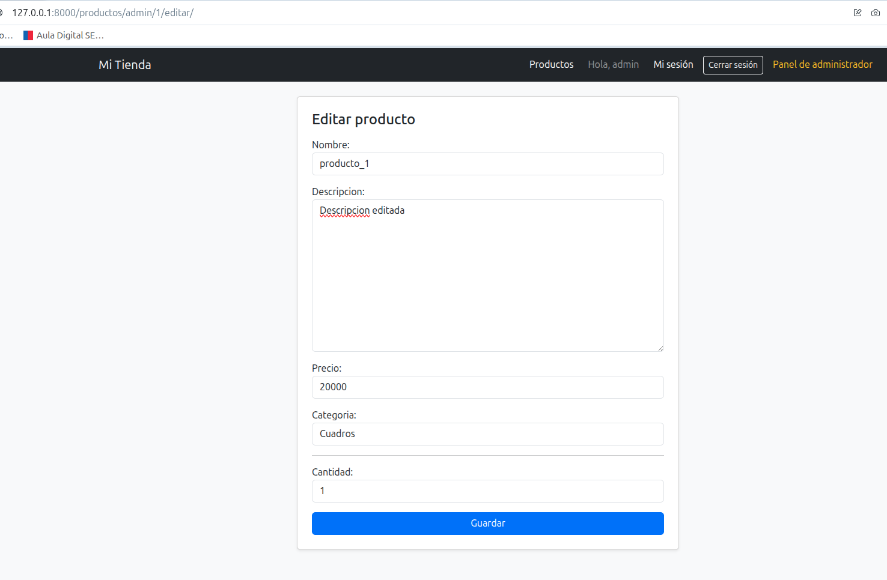
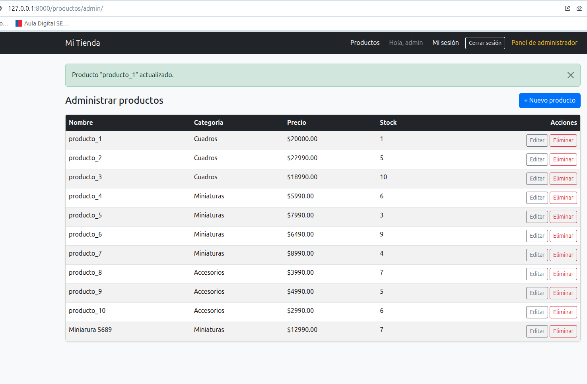
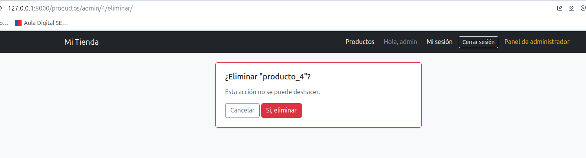
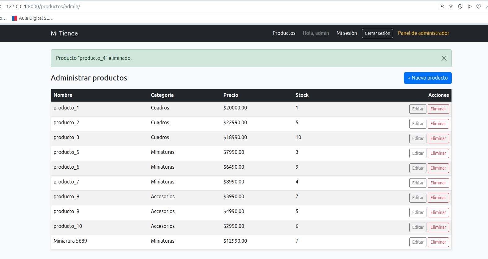
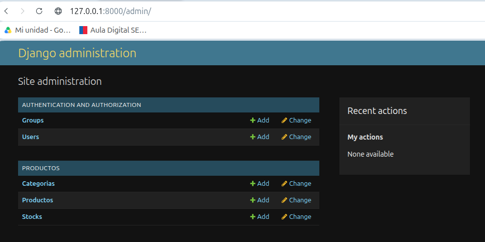
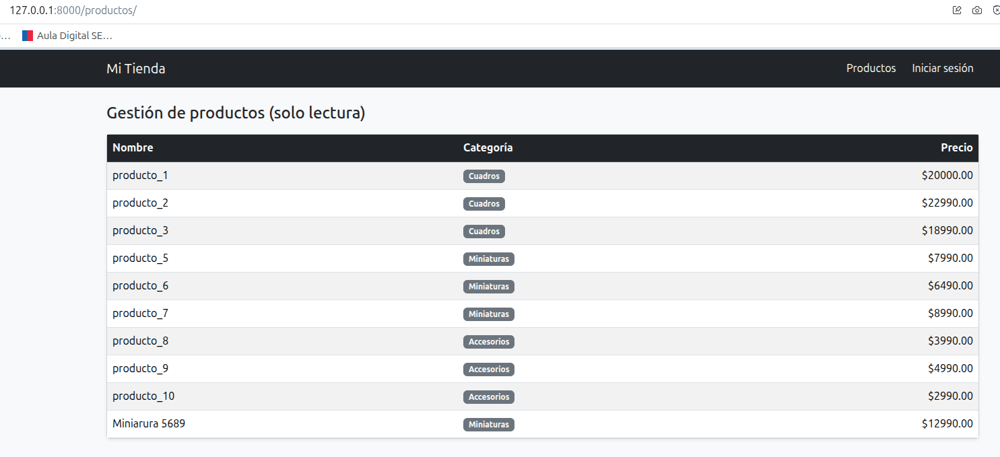

# Módulo 7 — Acceso a Datos con Django ORM (CRUD de productos)

## 1. Descripción general

Capa de acceso a datos del e-commerce mediante el ORM de Django. Se incorpora una app nueva, `productos`, con modelos en base de datos, un CRUD administrativo protegido por sesión.

## 2. Motor de base de datos utilizado

**SQLite** (motor por defecto de Django, `django.db.backends.sqlite3`). No requiere instalación ni configuración adicional: el archivo `db.sqlite3` se crea automáticamente al ejecutar `python manage.py migrate`.

> El proyecto también quedó preparado para PostgreSQL (driver `psycopg2-binary` en `requirements.txt` y soporte de variables de entorno en `settings.py`). Para migrar más adelante, basta con instalar PostgreSQL, crear la base de datos y el usuario, y configurar las variables de entorno correspondientes. Actualmente `DATABASES` apunta a SQLite.

## 3. Descripción del modelo de datos

| Modelo      | Campos                                                                 | Relación                                  |
|-------------|--------------------------------------------------------------------------|--------------------------------------------|
| `Categoria` | `nombre` (único), `descripcion`                                        | —                                          |
| `Producto`  | `nombre`, `descripcion`, `precio` (debe ser > 0), `categoria` (FK)      | `ForeignKey` a `Categoria`, `on_delete=PROTECT` |
| `Stock`     | `producto` (PK y FK a la vez), `cantidad`, `actualizado_en`             | `OneToOneField` a `Producto`, `on_delete=CASCADE` |

- `categoria` usa `PROTECT`: no se puede eliminar una categoría mientras tenga productos asociados.
- `Stock.producto` es la propia clave primaria de la tabla (no hay un `id` autoincremental aparte): modela la relación 1:1 real entre producto y su stock.
- `precio` valida `MinValueValidator(0.01)`, exigiendo un valor estrictamente mayor a 0, según el requisito del enunciado (sección 4).

## 4. Rutas principales del módulo de administración

| Ruta                              | Vista              | Acceso                       | Descripción                                  |
|------------------------------------|---------------------|-------------------------------|-----------------------------------------------|
| `/productos/admin/`                | `lista_productos`   | Protegida (`@login_required`) | Listado de productos con su categoría y stock.|
| `/productos/admin/crear/`          | `crear_producto`    | Protegida                    | Formulario para crear producto + stock inicial.|
| `/productos/admin/<id>/editar/`    | `editar_producto`   | Protegida                    | Formulario para editar producto y su stock.   |
| `/productos/admin/<id>/eliminar/`  | `eliminar_producto` | Protegida                    | Página de confirmación antes de eliminar.     |
| `/admin/`                          | Django Admin        | Solo superusuarios            | Panel administrativo nativo de Django.        |

Rutas relacionadas de módulos anteriores, reutilizadas en este flujo:

| Ruta          | Acceso     | Descripción                                              |
|---------------|------------|------------------------------------------------------------|
| `/login/`     | Pública    | Inicio de sesión (requerido para entrar a `/productos/admin/`).|
| `/productos/` | Pública    | Catálogo de productos, ahora leído desde la base de datos real.|

## 5. Pasos para ejecutar el proyecto

```bash
# Entorno virtual
python3 -m venv venv
source venv/bin/activate        # En Windows: venv\Scripts\activate

# Dependencias
pip install -r requirements.txt

# Migraciones (crean las tablas de auth, sesiones, productos, etc.)
python manage.py makemigrations
python manage.py migrate

# Usar PostgreSQL en lugar de SQLite (opcional)
# 1. Instalar PostgreSQL y crear la base de datos y el usuario.
# 2. Configurar las variables de entorno antes de iniciar el proyecto:
#    export POSTGRES_DB=nombre_bd
#    export POSTGRES_USER=usuario
#    export POSTGRES_PASSWORD=clave
#    export POSTGRES_HOST=localhost
#    export POSTGRES_PORT=5432
# 3. Ejecutar migraciones contra la base de datos PostgreSQL:
#    python manage.py migrate

# Superusuario para entrar al panel /admin/
python manage.py createsuperuser

# Levantar el servidor
python manage.py runserver
```

La aplicación queda disponible en `http://127.0.0.1:8000/` (redirige automáticamente a `/login/`).

### Cargar productos de ejemplo (opcional)

Para poblar el catálogo rápidamente sin pasar por el formulario uno por uno:

```bash
python manage.py shell < cargar_productos.py
```

## 6. Usuario de prueba

Para entrar a `/productos/admin/` se necesita una cuenta. Puedes:

- Registrar una cuenta normal desde `/registro/`, o
- Usar el superusuario creado con `createsuperuser` (también sirve para `/admin/`).

| Campo      | Valor de ejemplo       |
|------------|--------------------------|
| Usuario    | `admin`                 |
| Correo     | `admin@mail.com`        |
| Contraseña | (la definida al crear el superusuario) |

## 7. Evidencia

### 7.1 Listado de productos
`/productos/admin/` con sesión activa, mostrando los productos cargados (nombre, categoría, precio, stock).



### 7.2 Formulario de creación
`/productos/admin/crear/` con los campos del producto y del stock inicial completados.




### 7.3 Formulario de edición
`/productos/admin/<id>/editar/` modificando un producto existente.





### 7.4 Eliminación
Página de confirmación antes de eliminar un producto, y el mensaje de éxito tras confirmar.





### 7.5 Panel administrativo de Django
`/admin/`, iniciando sesión con el superusuario, mostrando `Categoria`, `Producto` y `Stock` registrados y navegables.



### 7.6 Catálogo público actualizado
`/productos/`, sin necesidad de sesión, mostrando los mismos productos que el panel de administración (confirmando que ambas vistas leen la misma base de datos).



## 8. Notas técnicas relevantes

- El CRUD de administración está protegido con `@login_required`: cualquier visitante puede ver el catálogo público, pero solo un usuario con sesión activa puede crear, editar o eliminar productos. No se restringe aún por rol (`cliente` vs `administrador`) — cualquier cuenta logueada puede administrar el catálogo.
- Crear o editar un producto guarda `Producto` y `Stock` dentro de una misma `transaction.atomic()`: si fallara el guardado del stock, el producto tampoco queda guardado, evitando productos sin registro de stock asociado.
- `select_related('categoria', 'stock')` se usa en los listados para traer la categoría y el stock de cada producto en una sola consulta SQL, en vez de una consulta adicional por cada fila.